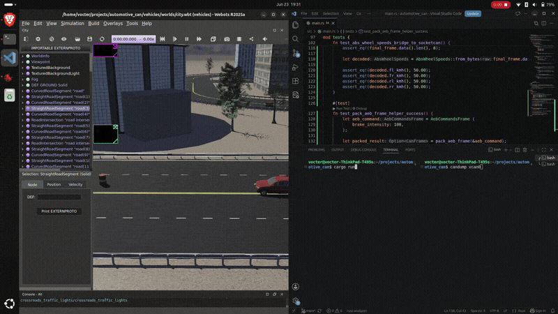
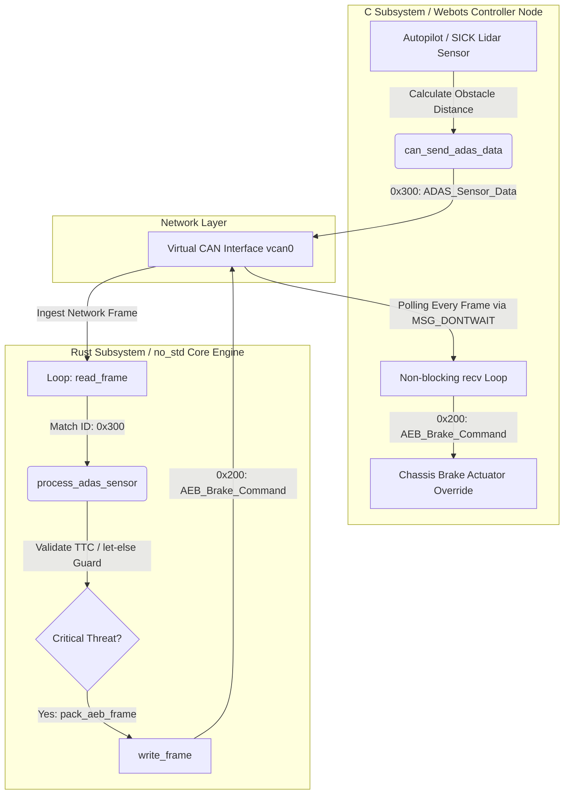

# Autonomous Vehicle Automotive CAN Bus & AEB Safety Core (SIL Software-In-The-Loop)

[](https://github.com/vockter/automotive_can/actions)


A high-performance, safety-critical **Software-In-The-Loop (SIL)** simulation demonstrating an Autonomous Emergency Braking (AEB) system. This repository establishes a deterministic, bidirectional communication bridge between an autonomous vehicle controller implemented in **C (Webots Simulator)** and a functional safety core engineered in **Rust**. Data exchange occurs in real-time over the Linux kernel's virtual CAN bus network layer (`vcan0`).

---

## 📺 System Demonstration



*The C-based vehicle autopilot streams sensor data over `vcan0`. The Rust Safety Core processes network frames in real-time, calculates immediate threat levels, and executes an emergency actuator override, bringing the vehicle to a complete stop before impact.*

---

## 🏗️ System Architecture

The simulation runs as an ecosystem of decentralized Electronic Control Units (ECUs) exchanging high-frequency frames over a virtualized CAN bus network layer:



1. **Telemetry & Actuation Node (C / Webots):** Packets and broadcasts vehicle dynamics metrics (Speedometer telemetry, Big-Endian encoded Wheel Speeds, and filtered Lidar sensor data) onto the bus. It listens for remote safety interventions, enforcing a hardware-like actuator override when a stop command is issued.
2. **ADAS Safety Core Node (Rust):** Ingests raw network payloads, decodes bit-packed signals safely without allocation, computes active safety parameters, and dispatches high-priority braking demands back to the powertrain.

---

## 🛡️ Automotive Standards & Safety Compliance Matrix

| Software Design Pattern | Automotive Standard Reference | Functional Engineering Purpose |
| :--- | :--- | :--- |
| **`#![no_std]` Core Execution** | **ISO 26262-6** (Heapless Constraints) | Completely guarantees zero dynamic memory allocations. Eliminates the risk of sudden Out-Of-Memory (OOM) kernel panics during execution. |
| **`let-else` & `?` Early Return** | **MISRA C:2012 Rule 15.5** | Prevents deeply nested conditional statements (*Pyramid of Doom*). Minimizes cyclomatic complexity for straightforward safety audits. |
| **`MSG_DONTWAIT` Async Polling** | **OSEK/VDX** Real-Time Principles | Ensures the C-controller telemetry polling remains completely non-blocking, preventing frame latency anomalies from lagging vehicle physics. |
| **Sterilized In-Memory Testing** | **ISO 26262** Software Verification | Validates internal byte-shifting constraints and signal scaling safely within host memory independent of active OS drivers or external noise. |

---

## 🧪 Automated Test Suite

All safety-critical encoding, decoding, and evaluation routines are backed by automated tests executing inside a deterministic, zero-hardware memory space:

```bash
$ cargo test
   Compiling automotive_can v0.1.0 (/home/vocter/projects)
    Finished `test` profile [unoptimized + debuginfo] target(s) in 0.03s
        Running unittests src/main.rs (target/debug/deps/automotive_can-5fe5aa8851eed1c6)

running 2 tests
test tests::test_abs_wheel_speeds_bridge_to_socketcan ... ok
test tests::test_pack_aeb_frame_helper_success ... ok

test result: ok. 2 passed; 0 failed; 0 ignored; 0 measured; 0 filtered out; finished in 0.00s
```

---

## 🚀 Environment Setup & Execution

### 1. Initialize Virtual CAN Interface (Linux Kernel)
Load the kernel modules and bind the virtual network interface link:
```bash
sudo ip link add dev vcan0 type vcan
sudo ip link set up vcan0
```
Monitor live network payloads directly via terminal tools:
```bash
candump vcan0
```

### 2. Launch the Autonomous Safety System
Compile and start the Rust safety daemon node:
```bash
cargo run
```

### 3. Run the Structural Test Suite
```bash
cargo test
```